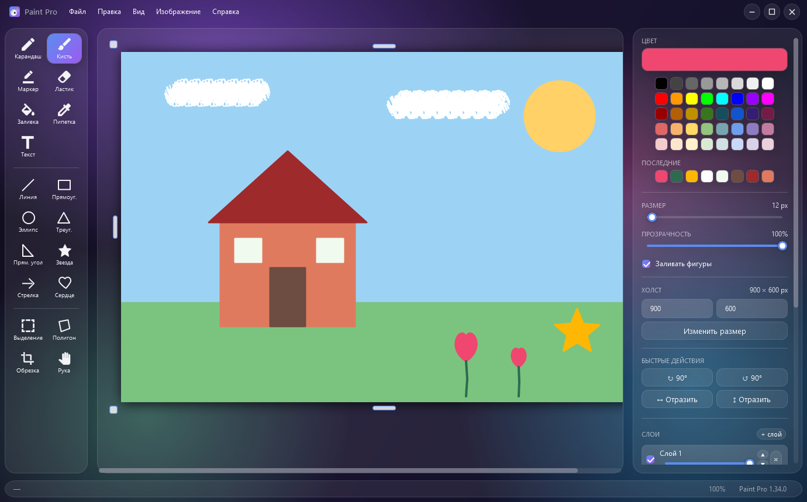

<div align="center">


# Paint Pro

**A raster image editor for Windows, written twice: once as a single HTML file inside Electron, once natively in C# 12 with WPF and SkiaSharp. Both are developed side by side, and a rule found on one side is carried to the other.**

[**Try it in your browser →**](https://alexalesha.github.io/PaintPro/) &nbsp;·&nbsp; [Download for Windows](https://github.com/ALEXalesha/PaintPro/releases/latest) &nbsp;·&nbsp; [Русская версия этого файла](README.ru.md)

[](https://github.com/ALEXalesha/PaintPro/actions/workflows/ci.yml)
[](https://github.com/ALEXalesha/PaintPro/releases/latest)
[](https://github.com/ALEXalesha/PaintPro/releases)
[](LICENSE)


</div>

> **The interface is in Russian only**, in both versions. The browser demo is the fastest way to see whether the thing is any good.

## Two versions of one editor

| | Electron | C# |
| --- | --- | --- |
| Folder | [`paint-pro-electron/`](paint-pro-electron/README.md) | [`src/`](docs/CSHARP.md), [`tests/`](tests/PaintPro.Tests) |
| Stack | one HTML file, canvas, vanilla JS; Electron adds the window, menu and file dialogs | C# 12, WPF, .NET 8, SkiaSharp, MVVM, Command pattern |
| Builds | installer, portable, and a single `.html` that runs offline in any browser | installer and a self-contained single `.exe` |
| Version | 1.20.0 | 1.34.0 |
| Tests | 469 Playwright checks in Chromium + 17 against the real app | 1123 xUnit tests, including two fuzzers |
| Docs | [README](paint-pro-electron/README.md), [architecture](paint-pro-electron/docs/ARCHITECTURE.md) | [README](docs/CSHARP.md) ([русский](docs/CSHARP.ru.md)) |

Both have nineteen tools (freehand, fill and eyedropper, text, eight shapes, rectangular and four-point selection, crop, hand), layers with opacity, five themes, a floating object you can drag, resize and rotate, and a history where any single edit in the middle can be switched off and the document is rebuilt without it.



## Why two

The Electron version came first. The C# one started as a port with a cleaner architecture: layers, MVVM, commands with diff bitmaps for undo, one mode enum instead of a pile of flags. Since then they have been kept equal in features, and most of the rules in either codebase were found on the other side. `paint-pro-electron/tests/parity.spec.js` is named after exactly that: each check carries the release that discovered the rule in C#.

## Tests find the bugs

Neither suite is a set of unit tests around functions. The Electron checks open the page in Chromium, move the real mouse over the canvas and read pixels back. The C# tests drive real WPF elements on an STA thread, read `MainWindow.xaml` to check every binding and hotkey, and fuzz the history tape with random edit sequences. The strongest invariant, in both, is that *the cursor position in the history alone determines the document, whatever path led there*.

[`CHANGELOG.md`](CHANGELOG.md) (in Russian) tells every release with its reasoning. Most entries start with what a test or a sweep found, not with what was planned.

## Screenshots are generated

No picture here was taken from the screen. `paint-pro-electron/tools/make-screenshots.js` launches the real app through Playwright and draws with real mouse movements. `tools/PaintPro.Screenshots` opens the real WPF window far off screen, draws with the real tools through the same path the mouse takes, and renders the window itself. The very first C# frames found two bugs, fixed in 1.27.0: half the tool icons stayed white in the light theme, and the default light-grey scrollbars cut across the dark glass.

## Releases

Each release carries the builds of both versions. Up to 1.15.0 only the Electron version was published here and the tags followed its numbers; from 1.27.0 the tag follows the C# number and the Electron version is in the release title and the file names.

Windows 10 or 11, x64. The binaries are not code-signed, so SmartScreen warns on first run.

## Building

```powershell
# Electron
cd paint-pro-electron; npm install; npm start

# C#
dotnet run --project src/PaintPro.Wpf -c Release
dotnet test tests/PaintPro.Tests
```

Packaging steps for both are in their READMEs.

## Licence

MIT, see [LICENSE](LICENSE).
