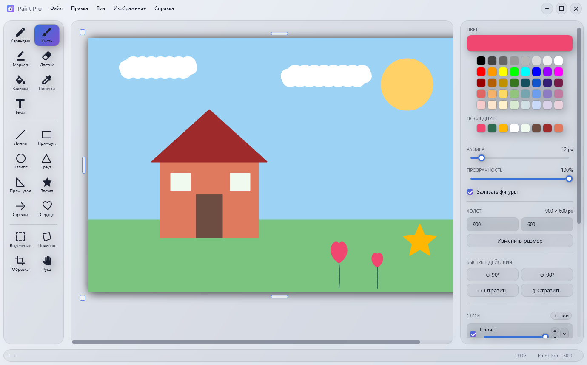
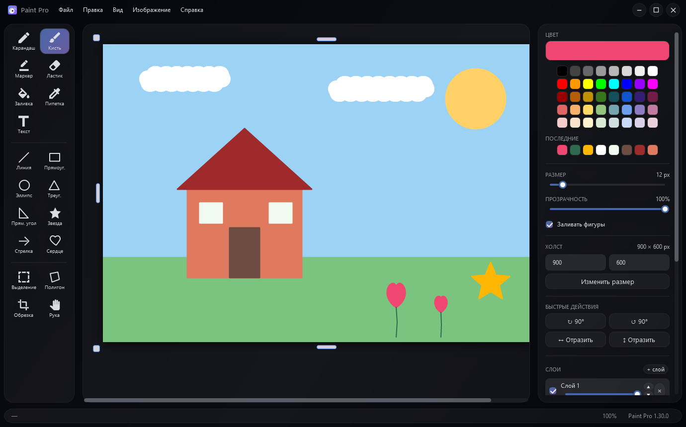

# Paint Pro: WPF + SkiaSharp

[Русский](CSHARP.ru.md) &nbsp;·&nbsp; [Both versions: repository README](../README.md) &nbsp;·&nbsp; [Download](https://github.com/ALEXalesha/PaintPro/releases/latest)

A raster image editor in the Apple Liquid Glass style, the native twin of the Electron version: C# 12, WPF on .NET 8, SkiaSharp for the pixels. The interface is in Russian.


 

## Inside

- `src/PaintPro.Wpf/`
  - `Models/`: `Document`, `Layer`, `Selection`, `FloatingPickup`, `DocumentMode`, `ToolKind`
  - `Commands/`: the Command pattern. Every edit is an `IDocumentCommand` with a diff bitmap for undo rather than a snapshot of the whole canvas; commands are bound to a layer id, not to "whatever layer is active now", so undo after a resize, rotation or deleted layer never writes into the wrong one.
  - `Tools/`: `ITool` and 19 implementations (pencil, brush, marker, eraser, fill, eyedropper, text, line, rectangle, ellipse, triangle, right triangle, star, arrow, heart, select, four-point polygon, crop, hand).
  - `Services/`: history with limits by depth and by memory, files, clipboard, geometry, view arithmetic (zoom, scrolling, handle positions) moved out of code-behind so it can be tested.
  - `ViewModels/`, `Views/`: MVVM; `Document.Render` assembles the layers, the tool preview and the floating object, and the same function feeds the screen, the saved file and the eyedropper.
- `tests/PaintPro.Tests/`: 943 xUnit tests.
- `installer/PaintPro.iss`: Inno Setup.
- `tools/PaintPro.Screenshots/`: the README frames.

The full design, with the seven anti-patterns of the original Electron code and how each is handled here, is in [`REWRITE_PROMPT_CSHARP.md`](../REWRITE_PROMPT_CSHARP.md). The running list of invariants (eighty-six so far, most with the bug that produced them) is in the [Russian README](CSHARP.ru.md#ключевые-инварианты).

## Tests

```powershell
dotnet test tests/PaintPro.Tests
```

Each test file is the analysis of one release, and each test is named after what it protects, not what it calls. Two of them are fuzzers:

- `TimelineFuzzTests`: random sequences of 25 kinds of edits from a seed, and invariants of the history tape over them. The strongest: *the cursor position alone determines the document, whatever path led there*. Another: switching an entry off and on again returns the document to the pixel.
- `DirtyFlagFuzzTests`: "the picture differs from the saved one ⇒ the document is marked changed", plus the check that an empty gesture does not mark it.

The view layer is tested with real WPF elements: `WpfRunner` keeps one STA thread for all such tests, and `XamlWiringTests` reads the whole `MainWindow.xaml` and checks every binding, command and hotkey. `ThemeTests` require the same set of keys in all five themes, readable text in each, and that the markup looks theme resources up dynamically. That last check used to cover two files out of five and let the tool icons through; see below.

## Screenshots are generated

```powershell
dotnet run --project tools/PaintPro.Screenshots
```

The tool creates the real `App` resources and `MainWindow` far off screen, draws the picture with the real tools through the same `OnPointerDown/Move/Up` path the canvas uses for the mouse (so every stroke goes through the commands and the history), switches themes on screen only, and renders the window's client area with `RenderTargetBitmap`.

The first frames found two bugs, fixed in 1.27.0. In the light theme half the tool buttons were white on light: their style took the colour once, from the glass theme, and never noticed a theme change. And the default light-grey Windows scrollbars cut across the dark glass; they are now a narrow track and thumb in the theme's colours.

## Building

.NET 8 SDK:

```powershell
dotnet run --project src/PaintPro.Wpf -c Release

cd src/PaintPro.Wpf
dotnet publish -c Release -r win-x64 --self-contained true `
  -p:PublishSingleFile=true -p:IncludeNativeLibrariesForSelfExtract=true `
  -p:EnableCompressionInSingleFile=true -o ../../dist
```

That gives `dist/PaintPro.exe` (about 78 MB, everything inside). The installer is Inno Setup 6 and packs that file, so publish goes first:

```powershell
& "$env:LOCALAPPDATA\Programs\Inno Setup 6\ISCC.exe" installer\PaintPro.iss
```

The version lives in two places that must match: `<Version>` in `PaintPro.Wpf.csproj` and `MyAppVersion` in the `.iss`.

The C# version installs as **Paint Pro** and the Electron one as **Paint Pro Electron**, into different folders with different ids, so both can sit side by side.
