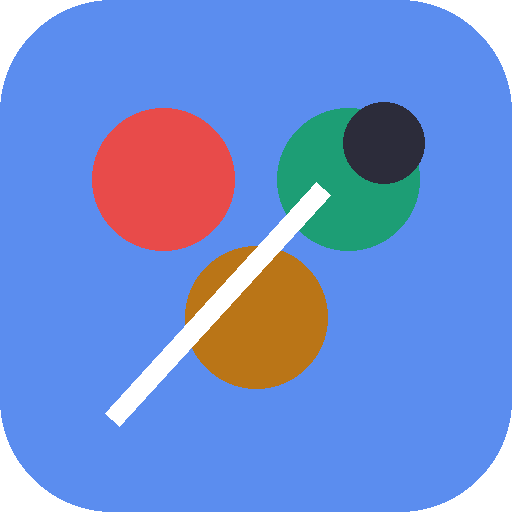
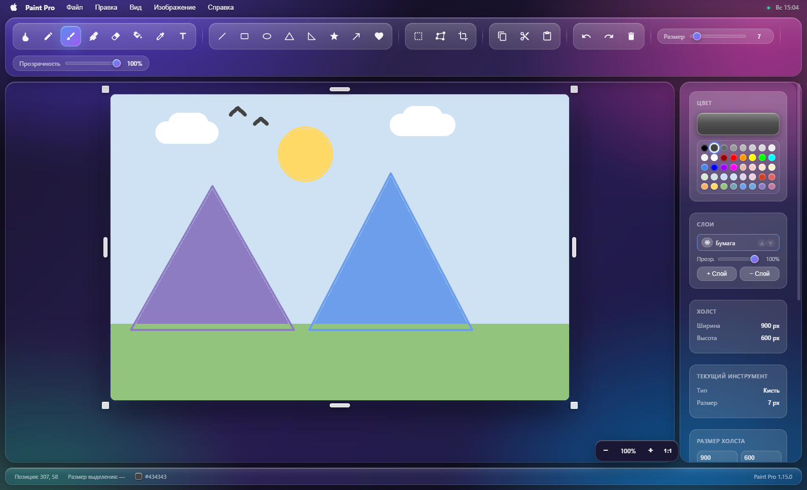
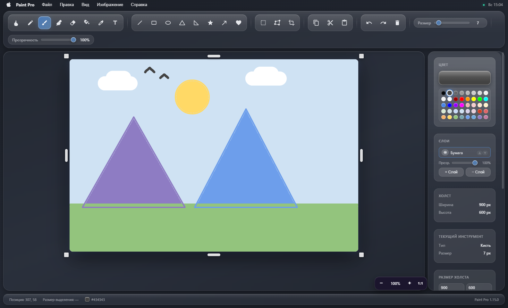
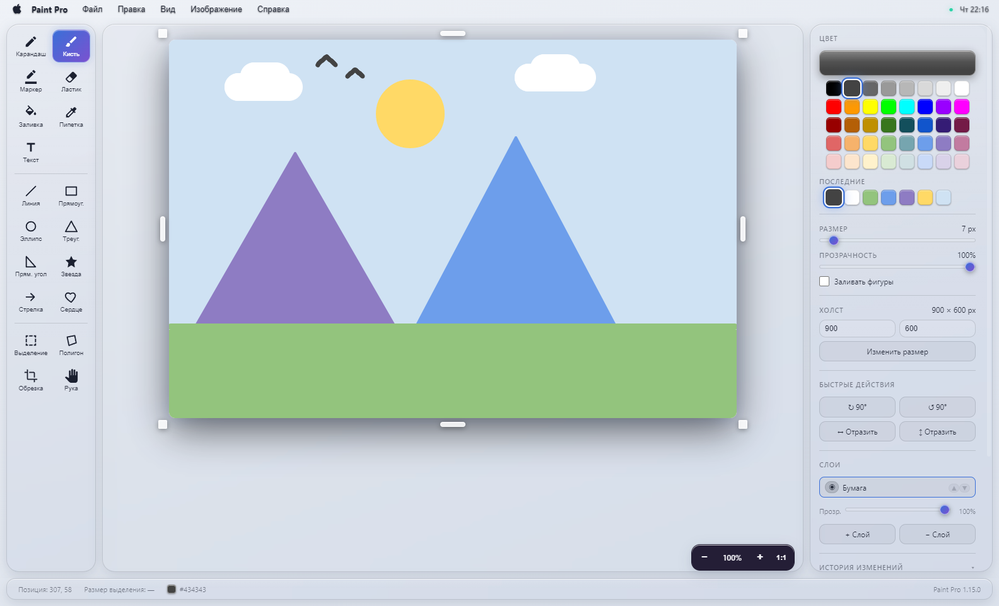
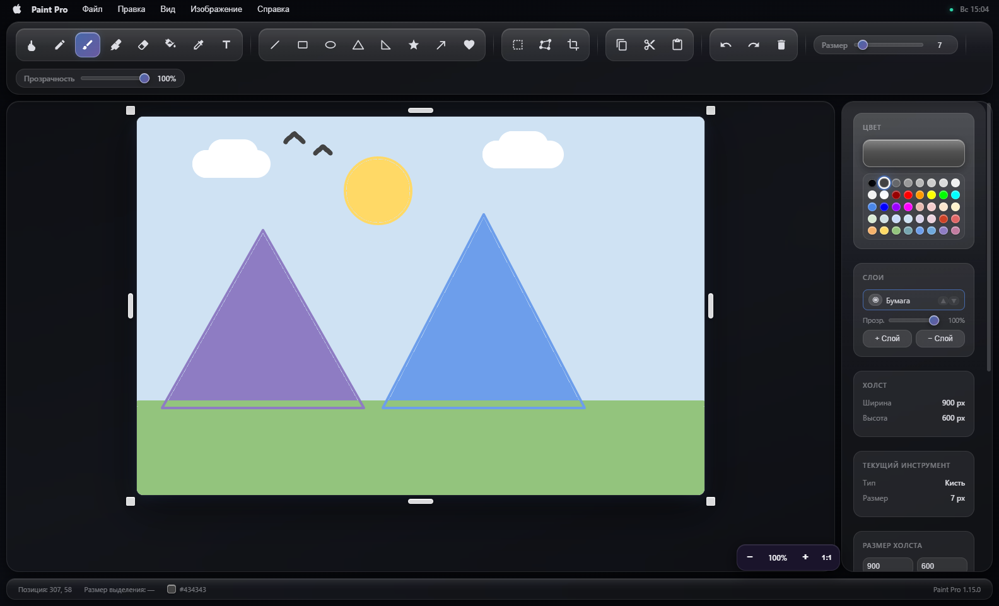
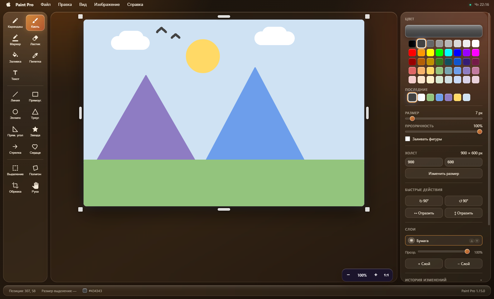
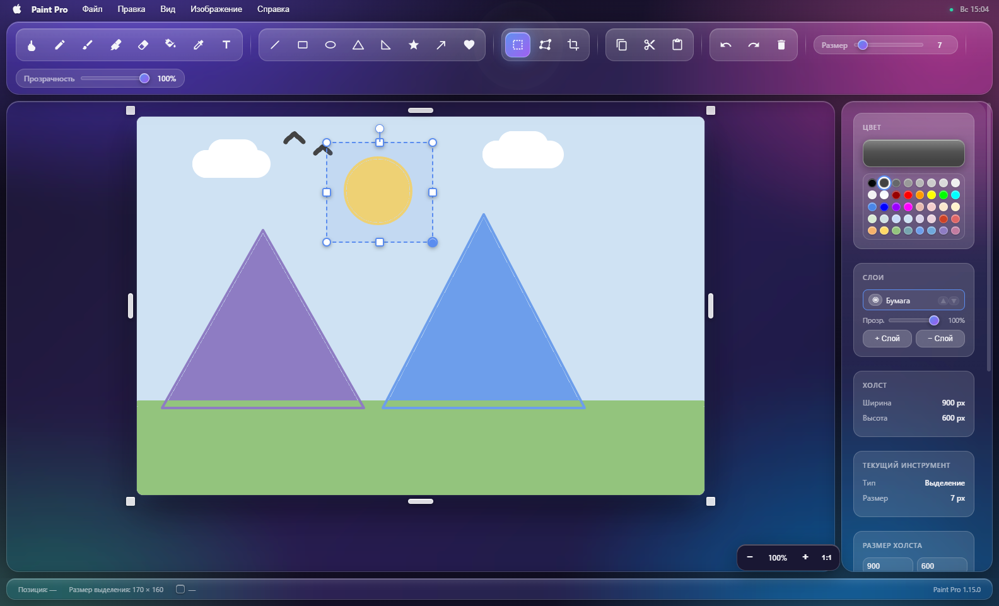
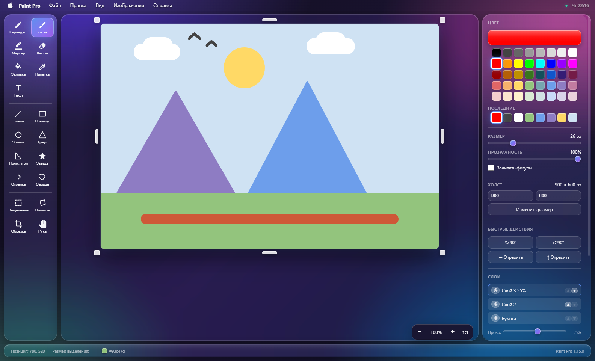

<div align="center">



# Paint Pro

**A raster image editor for Windows. The whole application is one HTML file; Electron only gives it a window, a menu and the native file dialogs.**

[**Try it in your browser →**](https://alexalesha.github.io/PaintPro/) &nbsp;·&nbsp; [Download for Windows](https://github.com/ALEXalesha/PaintPro/releases/latest) &nbsp;·&nbsp; [Русская версия этого файла](README.ru.md)

[](https://github.com/ALEXalesha/PaintPro/actions/workflows/ci.yml)
[](https://github.com/ALEXalesha/PaintPro/releases/latest)
[](https://github.com/ALEXalesha/PaintPro/releases)
[](LICENSE)



</div>

> **The interface is in Russian only.** There is no localisation layer and no plans for one - the strings are written into the markup. Everything below describes the program honestly; if you cannot read the menus, the browser demo is still the fastest way to see whether the thing is any good.

## What this actually is

One file, `paint-pro.html`, 280 KB, holds the entire editor: markup, styles and code, nothing fetched from the network. Three things are built from it and they are the same program:

| Build | What it is | Size |
| --- | --- | --- |
| Installer | NSIS, installs as *Paint Pro Electron*, own folder, file associations | 74.6 MB |
| Portable | single `.exe`, nothing to install | 74.4 MB |
| Browser | single `.html`, open it by double click, works offline | 274 KB |

The desktop builds carry a whole Chromium, which is why they weigh 74 MB and the same program in a browser weighs 274 KB. That is the honest trade for native menus, real Save dialogs and file associations.

Electron adds exactly four things: the window, the native menu, save/open dialogs and drag & drop of image files. Everything else - drawing, history, layers, selection - is plain canvas code that runs unchanged in a browser tab. The `window.electronAPI` bridge is checked before every native call, so the file degrades instead of breaking.

## Download

Latest builds are on the [releases page](https://github.com/ALEXalesha/PaintPro/releases/latest): installer, portable and the single-file browser build.

Windows 10 or 11, x64. The binaries are not code-signed, so SmartScreen will warn you on first run; that is a signature question, not a virus one.

## What it can do

Nineteen tools, five themes, layers, a history you can edit.

| Group | Tools |
| --- | --- |
| Freehand | pencil, brush, marker, eraser |
| Colour | bucket fill, eyedropper |
| Text | text with font and size |
| Shapes | line, rectangle, ellipse, triangle, right triangle, star, arrow, heart |
| Selection | rectangular select, 4-point polygon, crop |
| View | hand (pan), zoom 10-800 % |

Beyond the tool list:

- **Layers.** Add, remove, reorder, hide, per-layer opacity. Drawing goes to the active layer; the composite is assembled from the stack, and the same assembly function feeds both the screen and the saved file.
- **A history you can switch off entry by entry.** Not just undo and redo: any single edit in the middle of the tape can be disabled, and the document is rebuilt without it while everything after it stays. Turning it back on restores the document to the pixel.
- **A floating object.** Select a region, click inside, and the pixels lift off the paper: drag them, resize by eight handles, rotate with `[` and `]`. `Enter` applies, `Escape` puts them back.
- **Five themes** under *Вид → Тема*, remembered between runs. The canvas never follows the theme - paper stays white, because a theme that repaints your drawing is not a theme.
- **One layout with the C# version.** Tools on the left with captions; on the right colour, recent colours, size, opacity, canvas, quick actions, layers and history. Both side panels can be dragged narrower or wider, and the panel widths and the window's size and place are remembered.
- **Refusals that talk.** Every action that legitimately does nothing says so in the status bar instead of swallowing the click.

### Themes

| | |
| --- | --- |
|  |  |
| Стеклянная - gradient and glass, the default | Строгая - flat dark, muted blue |
|  |  |
| Светлая - dark text on light | Ночная - near-black for a dark room |
|  | |
| Тёплая - ochre and coffee instead of blue | |

### Selection and layers

| | |
| --- | --- |
|  |  |
| A selection with its eight handles; the status bar carries its size | Three layers, the top one at 55 % opacity |

## Keyboard

| Key | Action | | Key | Action |
| --- | --- | --- | --- | --- |
| `Ctrl+Z` | undo | | `P` | pencil |
| `Ctrl+Y`, `Ctrl+Shift+Z` | redo | | `B` | brush |
| `Ctrl+N` | new document | | `M` | marker |
| `Ctrl+O` | open | | `E` | eraser |
| `Ctrl+S` | save | | `G` | bucket fill |
| `Ctrl+Shift+S` | save as | | `I` | eyedropper |
| `Ctrl+C` / `Ctrl+X` | copy / cut | | `T` | text |
| `Ctrl+A` / `Ctrl+D` | select all / deselect | | `S` | select |
| `Ctrl+=` / `Ctrl+-` / `Ctrl+0` | zoom in / out / 100 % | | `Q` | 4-point polygon |
| `Delete` | delete selection or floating object | | `H` | hand |
| `Enter` / `Escape` | apply / cancel the floating object | | `[` `]` | rotate ±90° (`Shift`: ±15°) |

The mouse wheel over the canvas changes the size of the current tool, and says so when it hits the limit. With `Ctrl` held it zooms instead. Off the canvas, or with a tool that has no size, it scrolls the view as usual.

## Building and running

Node.js 18 or newer. The first `npm install` pulls Electron, about 150 MB.

```bash
npm install
npm start                 # run in development
npm test                  # 376 checks in Chromium, ~2 minutes
npm run test:app          # 14 checks against the real app, ~40 seconds
npm run build:web         # single-file browser build into dist/
npm run build             # portable .exe
npm run build-installer   # NSIS installer
npm run screenshots       # redraw every picture in this README
```

`npm test` needs a browser once: `npx playwright install chromium`.

The version number lives in exactly one place, the `version` field of `package.json`. The window, the About box, the built file names and the browser build all read it from there.

## About the tests

376 Playwright checks plus 17 against the packaged application. They are not unit tests around the functions; the page is opened in Chromium, the mouse really moves across the canvas, and the assertions read pixels back with `getImageData` or compare whole frames through `toDataURL`. Only the Electron bridge is stubbed. The 17 slow ones launch the real Electron binary and run code inside the main process, replacing native dialogs, because file writing and the close-without-saving question live there and nothing else reaches them.

Two of the files are fuzzers rather than examples. `fuzz.spec.js` generates random sequences of edits from a seed and checks four invariants of the history tape over them; the strongest is that *the cursor position alone determines the document, whatever path led there*. That one law covers more ground than any list of hand-written undo cases.

This approach is not a matter of taste. It is where the defects actually came from:

| Release | Found by | What it was |
| --- | --- | --- |
| 1.11.2 | the very first test run | three broken behaviours nobody had noticed |
| 1.11.3 | sweeping every dead-end action | 11 places that refused silently; they say why now |
| 1.11.5 | comparing the two code paths | paste had two routes, and the offset was fixed in one of them |
| 1.12.1 | a sweep over the new layer code | seven defects in one pass |
| 1.15.0 | asking what ends a mouse gesture | resizing a selection broke if the mouse strayed two pixels off the path |
| 1.16.0 | checking the layout in the real window | hotkeys did nothing on a Russian keyboard layout; buttons in a narrowed panel slid under the scrollbar |
| 1.16.1 | Dependabot alerts on GitHub | the app ran on Electron 33 with 32 known engine vulnerabilities; now Electron 44 |

The last one is the clearest example of why reading the code does not find these. The selection frame and its eight handles are overlay elements, not part of the canvas, so the cursor crossing a handle raises the same "pointer left" event as leaving the canvas entirely - and end-of-gesture hung on that event. Drawing perfectly along the path kept the handle under the cursor and hid the bug. Now a gesture ends when the button is released, and a stroke that runs off the edge of the canvas continues when you come back.

## Documentation

- [`docs/ARCHITECTURE.md`](docs/ARCHITECTURE.md) - how the thing is put together and the rules that hold it: the two-step IPC save, why transparency is one composite per stroke, the history ceilings, the floating object, what may touch the canvas directly. In Russian.
- [`docs/DEV_CONTEXT.md`](docs/DEV_CONTEXT.md) - the visual language: tokens, glass materials, the anti-patterns. In Russian.
- [`CHANGELOG.md`](CHANGELOG.md) - every release with the reasoning, not a list of commit subjects.

## Screenshots are generated, not taken

`npm run screenshots` launches the real application through Playwright, draws the picture you see above with actual mouse movements, walks through all five themes and saves every image in `docs/screenshots/`. Documentation pictures rot faster than documentation text, and nobody notices; this way they are one command away from being correct again. The script lives in [`tools/make-screenshots.js`](tools/make-screenshots.js).

## Where this comes from

Paint Pro has a twin: the same editor rewritten in C# 12 on WPF and SkiaSharp. The two are developed side by side, and most of the rules in this codebase were found on one side and carried to the other - `tests/parity.spec.js` is named after exactly that, each check labelled with the release that discovered the rule elsewhere. The C# version lives in the same repository: see [its README](../docs/CSHARP.md) and [the repository README](../README.md).

## License

MIT. See [LICENSE](LICENSE).
